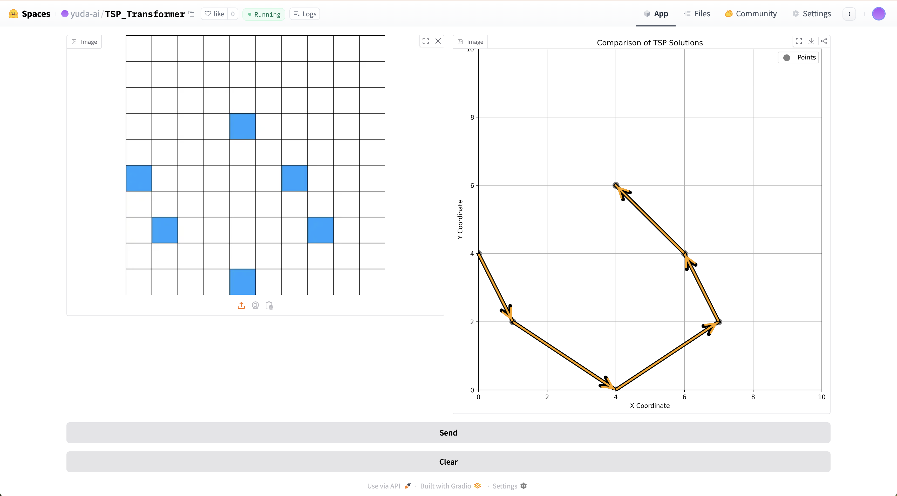
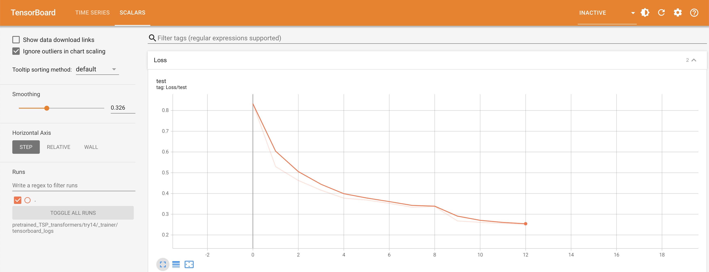
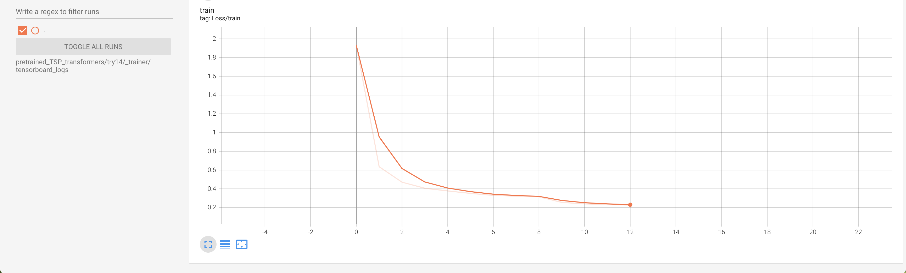

# Transformer for TSP

## Project Scope

This project does not aim to provide an optimal solution to TSP. Instead, it serves as an experimental framework for exploring transformer-based approaches, analyzing embedding behavior, and deriving insights for future research.

---

## Introduction

This project explores the application of transformer models to the Traveling Salesman Problem (TSP). Designed for researchers and engineers in neural combinatorial optimization, the model is available on [GitHub](https://github.com/yuda03979/TSP_Transformer) and [huggingface space](https://huggingface.co/spaces/yuda-ai/TSP_Transformer), where users can experiment with it directly.

Please note that this is a prototype built for research and experimentation rather than a fully optimized solution. Due to time and hardware constraints, performance is not maximized, but the findings remain valuable.

---

---

## 1. Dataset

### Data Generation

The dataset is constructed within a 10×10 grid, with each sample containing 6 points:

- Solutions are computed using brute force.

### Training and Test Data

- **Training Set**: Randomly sampled from all possible configurations, excluding cases where all x-coordinates are even. This dataset consists of **2,000,000 samples**. all the possibilities are ~3,130,929,607,680.
- **Test Set**: Comprises cases where all x-coordinates are even, totaling **800,000 samples**.

### Data Augmentation

To enhance generalization and robustness, the dataset underwent the following transformations:

- **Sorting**: Data points were sorted to make it easy for the model.
- **Mirroring**: Resulting paths were flipped to improve generalization.

---

## 2. Model Architecture

The model is based on a **Encoder-only transformer architecture** with the following key design choices:

the model is > 15M parameters.

- **Unmasked Attention**: No causal masking was applied, as full attention between elements was desired.
- **Token Masking**: Used to handle varying sequence lengths dynamically.
- **No Positional Encoding**: The model was designed to infer relationships between points without relying on absolute positions.
- **Lightweight Configuration**: Due to hardware constraints, the model consists of:
  - **2 Encoder layers**
  - **Hidden dimension (`d_model`) of 512**
  - **MLP inner dimension of 4096**

The overall architecture draws inspiration from **Gemma**.

---

## 3. Training Methodology

The model was trained with the following hyperparameters:

- **Learning Rate**: `1e-4` (constant, found to be effective, in the last 2 epoches i changed it to 1e-5, 1e-6 accordingly).
- **Batch Size**: 512 (largest viable size within hardware limitations).
- **Epochs**: 12

*Training process visualization:*\

---

## 4. Results & Key Observations

### Model Performance

The model demonstrates promising performance but has not been explicitly benchmarked for accuracy. Users are encouraged to experiment with the model directly in the [huggingface space](https://huggingface.co/spaces/yuda-ai/TSP_Transformer).

### constant n_points

now the model is only work on 6 points. but the code also support dynamic approach, but needs more computations.

## Future Directions

### Upcoming Enhancements:
- **Mamba**: Exploring its potential for sequence modeling.
- **Titans**: While not directly applicable to this problem, it may be relevant for future research.
- **Reinforcement Learning (RL)**: Investigating RL-based approaches for TSP.
- **Fusion Models**: Integrating image-based input and output representations.

### Long-Term Research Goals:
- **Prime Number Optimization**: Investigating transformer-based approaches for prime number-related problems.
- **Other Mathematical Challenges**: Extending the methodology to other complex mathematical problems.
---

